# 🛒 React E-Commerce Website

A simple e-commerce web application built using React.

## 🚀 Features

- Browse products
- View product details
- Add to cart
- Wishlist functionality
- Search products

## 🛠️ Tech Stack

- React.js
- JavaScript (ES6+)
- CSS

## 📦 Installation

1. Clone the repository:

```bash
git clone https://github.com/moazkhalifa-dev/website.git
```

## 📸 Screenshots

### 🏠 Home

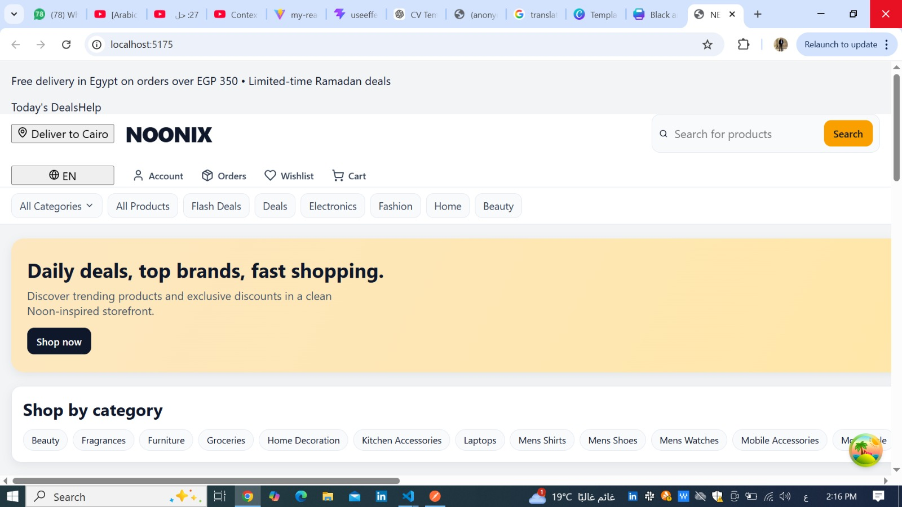

### 🛍️ Products

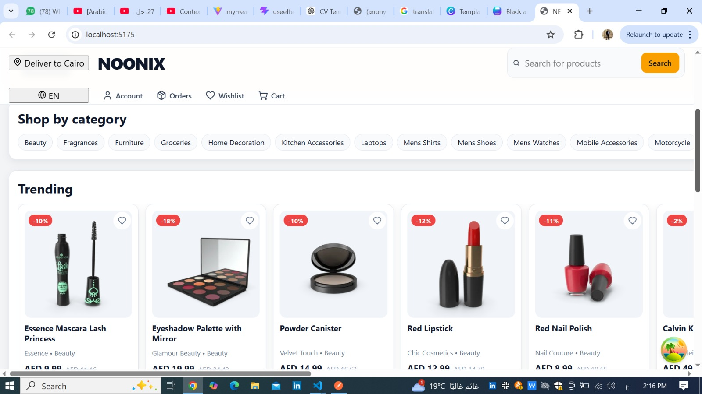

### 🔍 Search

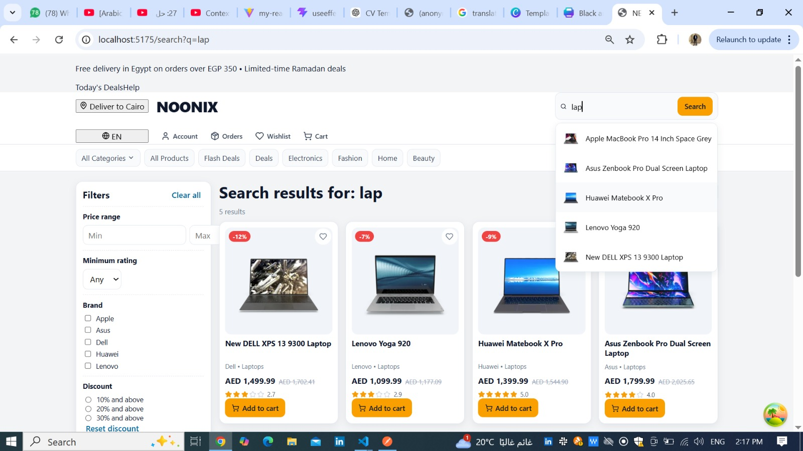
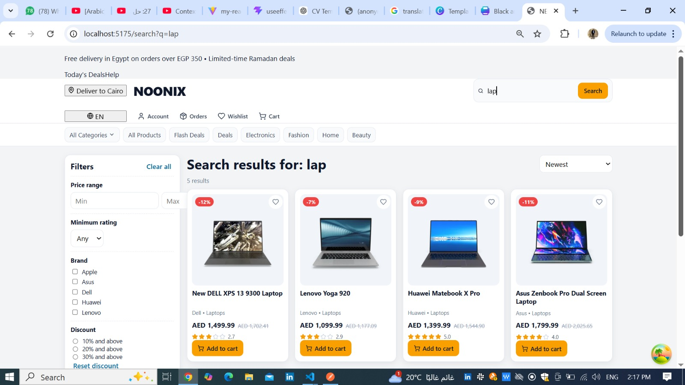
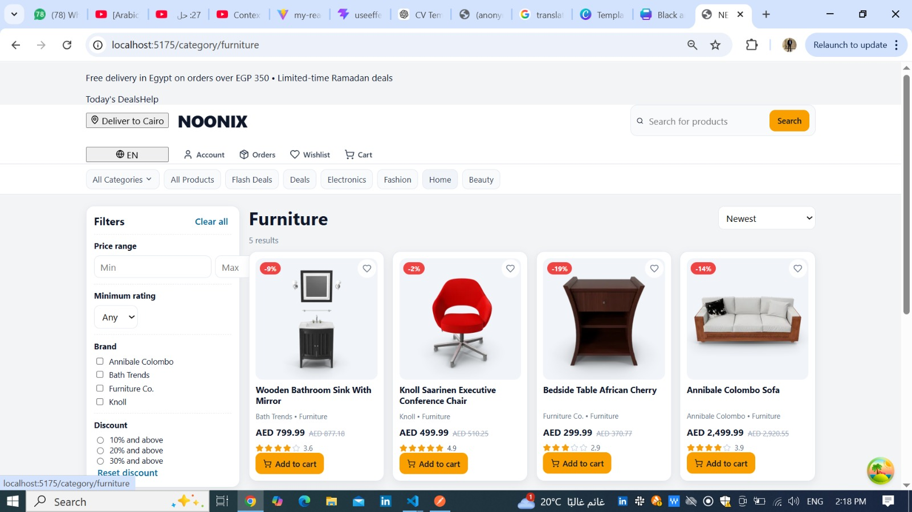
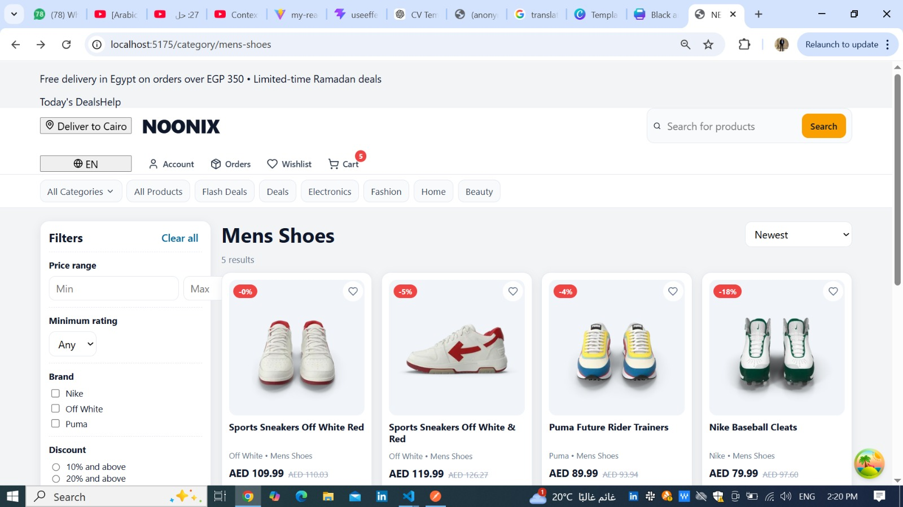

### 🧾 Category & Filters

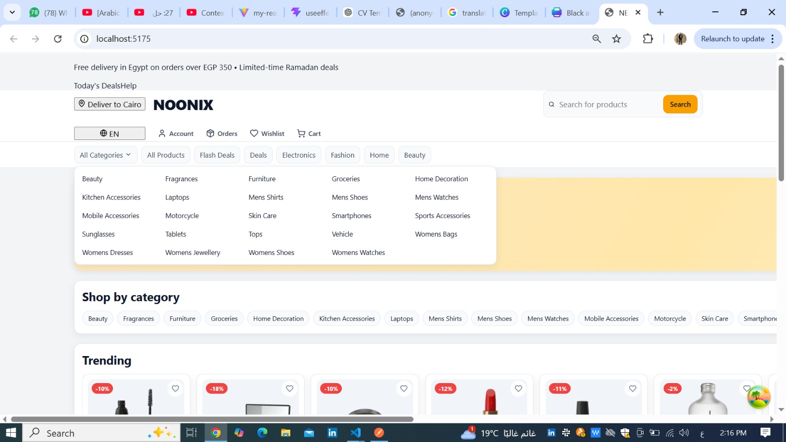
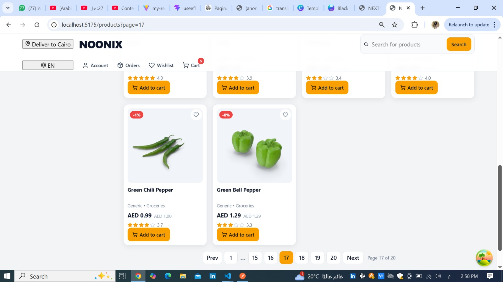
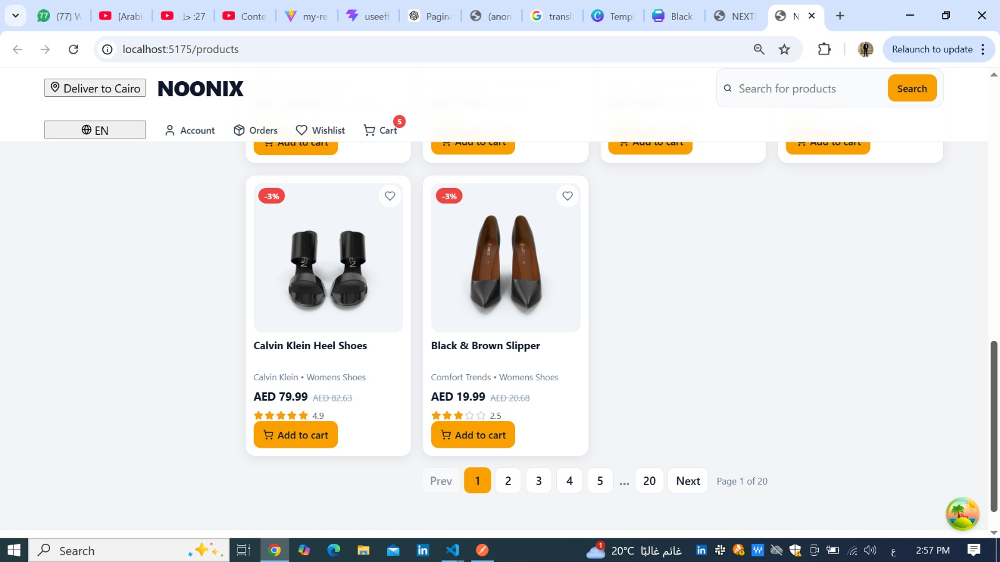

### 📦 Product Details

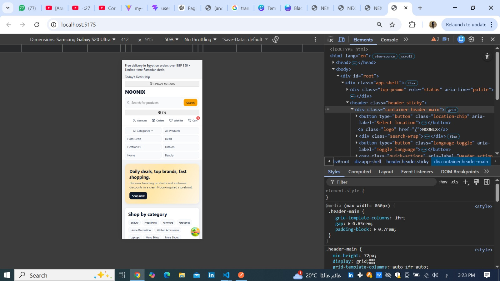
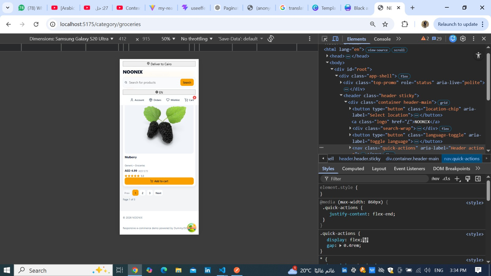

### 🛒 Cart

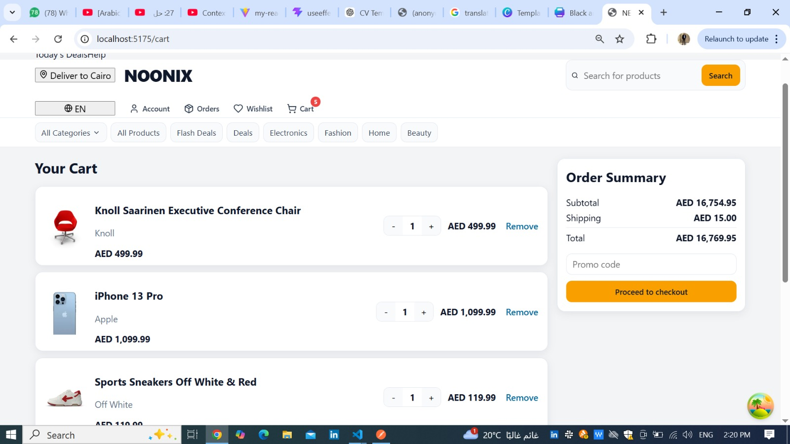
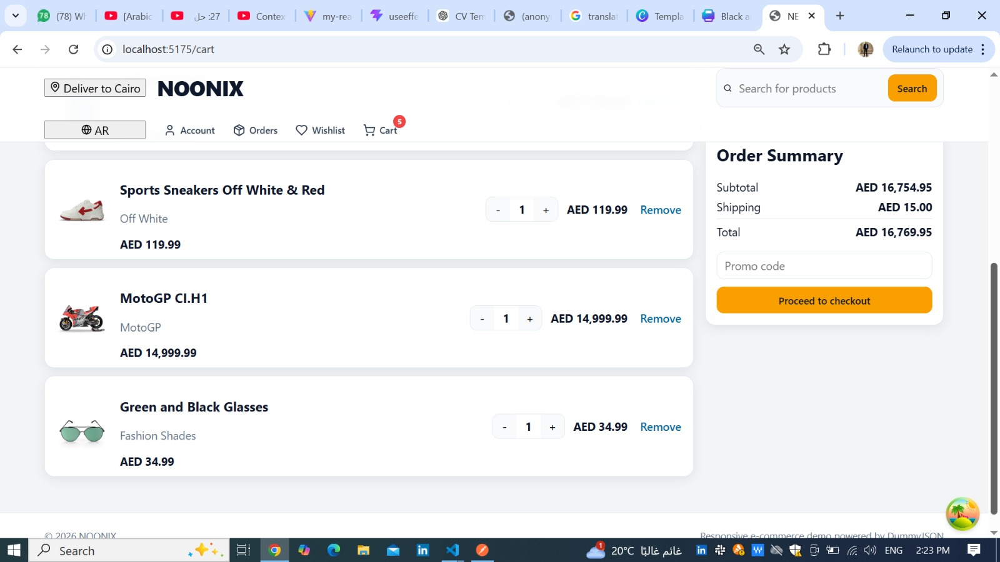

### 👤 Account

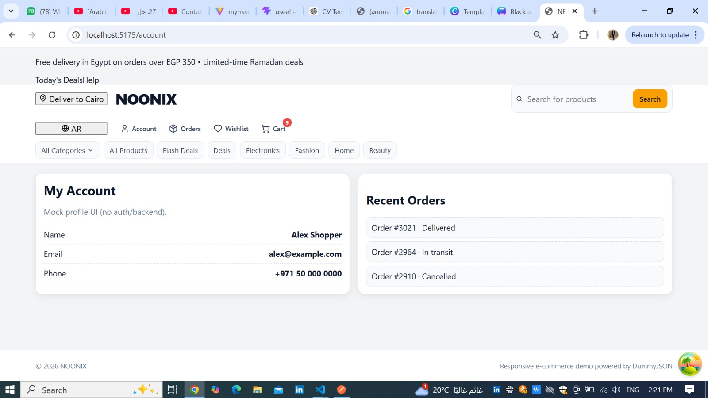
